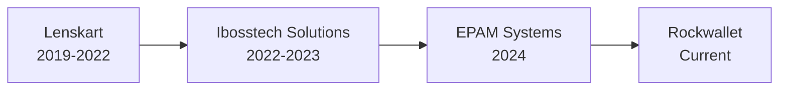

# 👋 Hello, I'm Kaushal Bhatt
### Senior Software Engineer | Cloud Architecture Specialist | Microservices Expert

---

## 🚀 About Me

I'm a passionate Senior Software Engineer with **5+ years of experience** in designing and implementing highly distributed, scalable cloud-based applications. Currently working at **Rockwallet**, where I'm architecting end-to-end microservices for crypto wallet platforms and leading blockchain integration initiatives.

My expertise lies in transforming complex business requirements into robust technical solutions, with a proven track record of improving system performance by up to **57%** and reducing processing times by **40%** through innovative automation and optimization strategies.

## 💼 Professional Journey

## 🛠️ Tech Stack

### Languages & Frameworks

### Cloud & DevOps

### Databases & Message Queues

### Frontend Technologies

## 🏆 Key Achievements

| Metric | Achievement |
|--------|------------|
| 🚀 **Performance** | Reduced system processing time by **57%** through optimization |
| ⏱️ **Efficiency** | Cut delivery time from **7 to 3 days** at Lenskart |
| 📈 **Scale** | Handled **10,000+ daily transactions** in order management systems |
| 🎯 **Accuracy** | Improved system accuracy by **38%** using real-time ML pipelines |
| ⚡ **Automation** | Reduced manual workload by **40%** through backend automation |
| 🛡️ **Reliability** | Achieved **95%+ code coverage** with automated testing |

## 🎯 Core Competencies

- **🏗️ Architecture Design**: Microservices, Event-Driven Architecture, Distributed Systems
- **☁️ Cloud Native**: AWS Services, Serverless Computing, Container Orchestration
- **🔄 Real-time Processing**: Kafka Streams, Event Processing, Data Pipelines
- **🔐 Blockchain Integration**: Crypto Wallet Development, Secure Transaction Processing
- **📊 Performance Optimization**: High Availability Design, Scalability, Latency Reduction
- **👥 Leadership**: Technical Mentoring, Cross-functional Collaboration, Agile/Scrum

## 📚 Featured Projects

### 🏦 **Crypto Wallet Platform** @ Rockwallet
- Architected end-to-end microservices from scratch
- Led blockchain integration for seamless transaction processing
- Implemented secure currency transaction mechanisms

### 📊 **Risk Management System** @ Ibosstech
- Built ML-powered fraud detection pipeline using Kafka + SageMaker
- Achieved 38% improvement in detection accuracy
- Processed real-time transaction streams at scale

### 🛍️ **Order Processing Optimization** @ Lenskart
- Redesigned backend systems reducing delivery time by 57%
- Integrated third-party APIs for inventory synchronization
- Received multiple "Best Employee of the Month" awards

## 📈 GitHub Stats

## 🎓 Education & Certifications

- 🎓 **B.Tech in Computer Science** (2015-2019)
- ☕ **Oracle Certified Java SE 8 Programmer** (Trained)
- ☁️ **Architecting on AWS** (AWS Training)
- 🔄 **DevOps & CI/CD Foundations** (LinkedIn Learning)

## 🌟 What I'm Currently Working On

- 🔗 Leading blockchain integration initiatives at Rockwallet
- 📱 Building secure and scalable crypto wallet functionalities
- 🏗️ Designing high-performance microservices architectures
- 📚 Exploring advanced distributed systems patterns

## 💡 Philosophy

> "Building software is not just about writing code; it's about creating scalable solutions that solve real-world problems while maintaining the highest standards of quality and security."

## 📫 Let's Connect!

I'm always interested in discussing new opportunities, innovative projects, and technology trends. Feel free to reach out!

📧 **Email**: kaushal8650@gmail.com  
💼 **LinkedIn**: [Kaushal Bhatt](https://www.linkedin.com/in/kaushal-bhatt)  
🌐 **Location**: India | Open to Global Opportunities

---

*"Transforming complex challenges into elegant solutions, one line of code at a time."*

